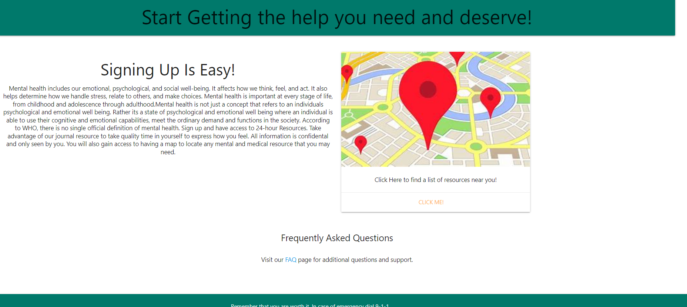

# FreeMind

## Description

FreeMind is a Mental Health Resouce locator and can help users tack and log their symptoms for more productive mental health results. User data is stored safely in the FreeMind database and can be called back durin therapy session to better recall medication side effects or to track improvements.

## Installation

Users must have a computer or mobile devise with a web brouser such as Chrome installed. 

## Usage

Users can log in and review their old journal enteries or serch the resource map to find a provider that fits their needs.

## Credits
Faith Wallace: https://github.com/sublime-sweetie

Designs by :Jeniah Turner: https://github.com/turnerjeniah8

## MIT License

Copyright (c) 2022 sublime-sweetie

Permission is hereby granted, free of charge, to any person obtaining a copy of this software and associated documentation files (the "Software"), to deal in the Software without restriction, including without limitation the rights to use, copy, modify, merge, publish, distribute, sublicense, and/or sell copies of the Software, and to permit persons to whom the Software is furnished to do so, subject to the following conditions: The above copyright notice and this permission notice shall be included in all copies or substantial portions of the Software.

THE SOFTWARE IS PROVIDED "AS IS", WITHOUT WARRANTY OF ANY KIND, EXPRESS OR IMPLIED, INCLUDING BUT NOT LIMITED TO THE WARRANTIES OF MERCHANTABILITY, FITNESS FOR A PARTICULAR PURPOSE AND NONINFRINGEMENT. IN NO EVENT SHALL THE AUTHORS OR COPYRIGHT HOLDERS BE LIABLE FOR ANY CLAIM, DAMAGES OR OTHER LIABILITY, WHETHER IN AN ACTION OF CONTRACT, TORT OR OTHERWISE, ARISING FROM, OUT OF OR IN CONNECTION WITH THE SOFTWARE OR THE USE OR OTHER DEALINGS IN THE SOFTWARE.

## Features

FreeMind Mental Health Resources uses geolocating, geocoding, and places API to provide users with a specialized and unique journal entries that allow users to keep track of their mental health journey as well as providers theyve contacted in the past. 

## How to Contribute

If you would like to make a contribution to the FreeMind provider database or would like to submit feedback please email faith.wallace.2@gmail.com.

